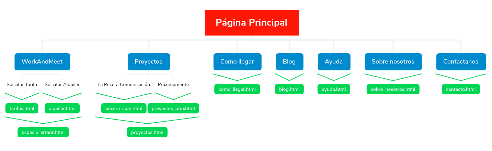

# DIU20
Trabajo Final

Jose Armando Albarado Mamani
3 GII 

----- 

Pequeña descripción del Coworking
-----

El coworking es una técnica de trabajo que ha adquirido bastante importancia en estos últimos años, en españa hay más de 500 registrados, y en Europa hay alrededor de 1600 espacios dedicados al coworking. Pero claro, ¿Qué es el coworking?
El coworking es una técnica de trabajo en la que en un determinado espacio se dan cita profesionales de cualquier ámbito. En este espacio de coworking existe gestores que se encargan de conectar y crear oportunidades profesionales y personales entre cada uno de sus miembros. El objetivo principal del coworking es que los profesionales puedan compartir entre ellos conocimientos e incluso trabajar juntos en proyectos que surjan.

En este trabajo voy a analizar espacio de coworking en Granada, ErranT, este espacio de coworking dispone de una página web https://www.errant.es/es/, esta página será el objetivo del análisis y como consecuencia del análisis realizado procederé a proprocionar un rediseño de ella.

1.Usability Review
----
Enlace al documento: ![UsabilityReview] (Usability-review-template.xlsx)

Valoración final: 65/100

Comentario sobre la valoración:

Después de valorar cada apartado de la plantilla y tras comentar los peores apartados de la web, la puntuación final es de 65/100, lo cual hace un aprobado. La justificación de esta nota es que en general esta web está bien estructurada y clara, aunque tiene algunos problemas los cuales son importantes, como por ejemplo la falta de una sección de ayuda en la página, la página principal llama poco la atención a un cliente que puede entrar con espectativas de encontrar un ambiente amigable y sociable. Por otro lado, otro de los grandes problemas es que no se pueden obtener tarifas de forma online, si no que debes ir al apartado de contacto y rellenar un formulario indicando que quiere obtener una tarifa, hoy en día este aspecto ha adquirido gran importancia ya que normalmente casi todo se puede realizar de forma electrónica, es por ellos, que sin lugar a duda se debe impelementar que las tarifas se puedan obtener mediante la web de forma electronica. En general, la página principal contiene poca información que pueda llamar la atención de un usuario, añadir imágenes o videos que reflejen el buen ambiente de trabajo en el lugar sería algo que sin lugar a duda atraería la atención de los usuarios.

## Paso 2. UX Design 

2.a Feedback Capture Grid
-----

 

2.b Propuesta de valor
-----

Mi propuesta de rediseño para esta página consta de varias partes:

1.- Dar un toque más moderno a la página: La página en general da la sensación de que se ha realizado en un momento dado y no se ha vuelto a realizar modificaciones en ella, es por ello que pretendo introducir más información en la página principal, como un carrusel de imagenes, organizar la información que hay en ella de otra forma, reducir el tamaño del mapa, etc. Con el objetivo de atraer la atención de cualquier usuario que visite nuestra página por primera vez.

2.- Añadir una sección de ayuda: La página no consta de una sección de ayuda, luego es esencial añadir una seccion de ayuda que esté bien estructurada y que sea clara, con el objetivo de ayudar al usuario en la navegación en nuestra web.

3.- Permitir realizar transacciones online: Por ejemplo, obtener tarifas de forma online, programar estos pagos para que un usuario que quiera obtener una tarifa online lo pueda realizar sin problemas y así evitamos que tenga que rellenar un formulario y estar pendiente de los correos que recibe por parte de la empresa.

4.- Cambiar los colores que se emplea: El contraste que se emplea en la página actual es muy bajo, ya que cuesta un poco diferenciar el contenido de algunas páginas en relación con el color de fondo que emplean, es por ello que optar por otros colores en los que el contraste de colores sea mayor, para que personas con algun tipo de problema de visión pueda informarse sin problema.

5.- Cumplir con los requisitos mínimos de W2G: Disponer de una sección de Accesibilidad indicando que nuestra página cumple los requsitos mínimos para que se pueda navegar aún con algunos problemas de salud o problemas de otro tipo.

 

2.b Tasks & Sitemap 
-----
En el sitemap he introducida varias de las páginas que introduciría en un remodelado de la web:

1.- En la sección "Espacio Errant" se almacenará las gestiones tanto de alquiler como la de obtener una tarifa.
2.- En la sección "Proyectos" se introducirán aquellos proyectos que se estén en proceso de desarrollo o aquellos proyectos que ya se han finalizado como "La Pecera comunicación".
3.- En la sección "Como llegar" será una página que contendrá un mapa con el que el usuario podrá interactuar para poder trasladorlo a su dispositivo movil o para moverse en el. Obviamente en el mapa debe estar marcada la posición de nuestra en la ciudad, para que el usuario sepa como llegar.
4.- En la sección "Blog" se añadirán esperiencias de los usuarios que han estado en nuestras instalaciones, cada sección de blog debe contener una foto de la persona y el comentario que realiza sobre la experiencia que ha tenido en nuestras instalaciones. De esta forma los demás usuarios que nunca han estado en nuestras instalaciones podrán comprobar experiencias de otros usuarios y así anirmarse a probar.
5.- En la sección de "Ayuda" se añadirá información que ayudará al usuario a navegar por nuestra web, e incluso algunas preguntas frecuentes con sus respectivas respuestas.
6.- En la sección "Sobre nosotros" se añadirá información acerca de la empresa, las personas que trabajan ahí, información acerca del fundador, etc.
7.- En la sección "Contáctanos" se añadirá un formulario para que el usuario que desee pueda contactarnos a través de este formulario, además se indicarán todas nuestras redes sociales disponibles para que el usuario pueda visitarlas. Es importante por tanto ser activo en las redes sociales para mostrar a los usuarios que somos activos y añadimos contenido acerca de las instalaciones, etc.

2.c Labelling 
----
Como se trata el rediseño de la web, cada una de las secciones del labelling hace referencia a las secciones disponibles en la barra de navegación, por tanto, no es necesario introducirlas como iconos ya que será su nombre completo. De todas formas en caso de que necesite algunos iconos para representar cada una de las secciones optaría por iconos standar, para que al usuario les resulte familiar.

 

2.d Wireframes
-----

Los bocetos los he realizado para web como se pedía en el enunciado del trabajo, en ella explico como seria cada una de las ventanas de las que está formada la página workandmeet, por tanto son varias partes:

-Página principal: Incluye una serie de imagenes y algunos buenos comentarios sobre la experiencia que han obtenido en nuestras instalaciones.
- Workandmeet: Permite seleccionar dos opciones, la opción de acceder a las tarifas o para acceder a los alquileres. En el boceto se especifica como sería la página para seleccionar una de las opciones, mientras que el detalle de alguna de ellas sería del estilo de la página detalle de un proyecto, especificando los detalles de la tarifa o el alquiler.
- Proyectos: En la página principal de proyectos habría una opción de elegir que proyectos elegir, en el boceto se detalla como sería un proyecto en concreto, mientras que la página para seleccionar un determinado proyecto sería igual que la página de seleccion de tarifas y alquiler en la sección workandmeet, es por ello que no lo he repetido, en ninguno de los casos.
- Como llegar: Contiene un mapa interactivo y una sección de contacto.
- Blog: Contiene una lista de blogs disponibles para poder leer, el detalle de un blog sería de forma similar al que se detalla un proyecto.
- Ayuda: En la página se detallan ayudas en la navegación y se añaden algunas preguntas frecuentes con sus respectivas respuestas, además se incluye una sección de contacto al final de la página.
- Sobre nosotros: Información de la compañía y una sección de contacto por si el usuario tiene algún tipo de duda.
- Contactanos: Se muestran las redes de las que dispone la empresa y una pequeña sección de contacto.

3.b Logotipo
----

Para la creación del logo he usado un sitio web que te permite realizar logos de forma gratuita, esta página es https://logo.e.jimdo.com

3.c Guidelines
-----
Como tipografía principal de la web he decido optar por una tipografía que ya he empleado en las prácticas pero creo que es ideal para este tipo de webs, ya que se trata de una fuente moderna, sencilla y perfectamente legible. Esta fuente es Roboto. Roboto es una fuente de uso libre de Google Fonts. Esta tipografía la podemos combinar con otra tipografía como por ejemplo Open Sans, la cual es también muy utilizada, de uso libre y desarrollada por Google Fonts. Por tanto como tipografía principal empleamos Roboto y como tipografía secundaria Open Sans. Respecto al tamaño de fuente hemos decidido seguir los estándares, para Roboto se recomienda usar un tamaño de 14-18px para el contenido principal mientras que para las cabeceras un tamaño de 28-34px. Respecto a Open Sans también seguimos los estándares, es decir, utilizar un tamaño de 12-16px para contenidos principales y un tamaño de 24-30px para cabeceras. A continuación adjunto un par de imágenes de cada tipo de fuente:

Roboto:
 

Open Sans:
 

-Fuente de las imágenes: https://medium.muz.li/top-5-ui-fonts-for-website-mobile-apps-d78829e58f7e

Respecto a los colores que vamos a utilizar en nuestra página web he optado por unos colores que proporcionen confianza y seriedad a los usuarios, es por ello que la combinación de los colores blanco y negro, en sus distintas variantes me parecen ideales para el desarrollo de esta Web.

Color de letra: Blanco.
Color de Títulos: Blanco 
Color de la Barra de navegación superior: Negra.
Títulos y contenido en cada una de las páginas: Blanco.

Mi objetivo es jugar con el blanco y el negro, proporcionando así una aplicación que emplea colores básicos y que pretende dar gran importancia a su contenido. Es decir, buscamos que el usuario cuando entre a nuestra página sea soprendido por las imágenes, textos, contenidos en general del que disponde nuestro sitio web. Por ello evito utilizar color llamativos ya que esto provocaría que al usuario no le resulte interesante el contenido de la web, si no que estará sorprendido por los colores llamativos que se han usado, consiguiente así que el usuario no se interese por nuestro contenido.

Respecto a los patrones:

En primer lugar, he decidido optar por la barra de navegación lineal ya que es bastante útil, fácil de ententer si se incluyen titulos descriptivos y si no se introduce excesiva de información en ellas. Además se utilizan en muchísimas páginas web en internet, luego al usuario le resultará familiar esta barra y sabrá perfectamente como funciona, pro tanto, considero que es una desición ideal para este caso.

Además, en la barra de navegación se incluye una lupa que permitirá realizar búsquedas en el sitio web, considero que es imprescindible introducir esta herramienta pues muchos usuarios suelen recurrir a esta herramienta cuando se encuentran perdidos, luego será sin lugar a duda una herramienta que mejore la experiencia de los usuarios.

Respecto a la organización de la información he decido optar por una mezcla entre la organización en bloque y en carrusel para las imágenes, considero que el carrusel es una buena herramienta cuando se quiere mostrar muchas imágenes y se evita que el usuaria se canse de hacer scroll hacia abajo en busca de todas las imágenes, en su lugar se emplea un carrusel lo cual ayudará al usuario a observar todas las imágenes sin necesidad de hacer scroll hacia abajo durante un largo tiempo. Por otro lado, para la organización de imágenes y de contenido textual empleo también bloques de dos columnas, de una columna, etc. Con el objetivo de combinar una imagen con el texto de la mejor manera posible, por ejemplo, si se dispone de una foto y se quiere añadir un texto, pues se opta por un bloque de dos columnas, en el que en un lado estará la imagen y en el otro el texto, y así sucesivamente cambiando de lado la imagen y el texto en cada iteración para que no sea todo el momento lo mismo.

## Conclusión
Me ha sorprendido bastante el funcionamiento del coworking, es la primera vez que escucho este concepto de trabajo, me parece una forma perfecta de conocer otros profesionales de otros ambitos y a la vez poder compartir con ellos conocimientos, proyectos, etc. El conocimiento es poder, y el coworking hace que profesionales compartan sus conocimientos con otras personas e incluso que algunos profesionales adquieran nuevos conocimientos, luego seguro que para un profesional es bastante útil ya que puede ayudar a otras personas o incluso que este profesional resulte beneficiado adquiriendo nuevos conocimientos. Creo que en el futuro este concepto se ampliará bastante en España y habrán muchos lugares más disponibles para realizar coworking.

